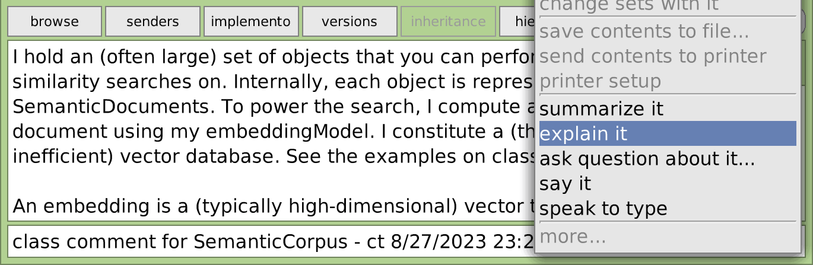
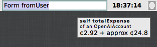
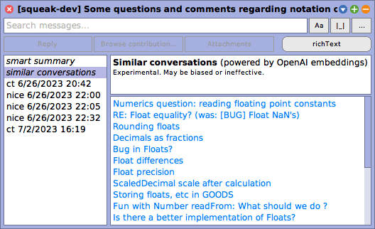

# Squeak-SemanticText

> ChatGPT, embedding search, and retrieval-augmented generation for Squeak/Smalltalk

*Semantics* (from Ancient Greek *sēmantikós*) refers to the significance or meaning of information. While the normal `String` and `Text` classes in Squeak take a syntactic view on text as a sequence of characters and formatting instructions, `SemanticText` focuses on the sense and understanding of text. With the advent of NLP (natural language processing) and LLMs (large language models), the availability of text interpretability in computing systems is expanding substantially. This package aims to make semantic context accessible in [Squeak/Smalltalk](https://squeak.org) by providing the following features:

- **[OpenAI API](https://platform.openai.com/docs/api-reference) client:** Currently supports chat completions, embeddings, and speech transcription/synthesis. Includes tools for managing rate limits, tracking expenses, and estimating prices for queries.
- **SemanticConversation:** Framework for conversational agents like ChatGPT as well as autonomous agents, including function calling.
- **ChatGPT:** Conversational GUI for Squeak. Supports streaming responses, editing conversations, and defining system messages.
- **SemanticCorpus:** Framework for semantic search, similarity search, and retrieval-augmented generation (RAG, aka "chat with your data") through the power of text embeddings. Implements a simple yet functional vector database.
- **Experimental tools** such as an integration of semantic search and RAG into Squeak's Help Browser or Squeak's mailing list.

For more details, install the package and dive into the class comments and code, or continue reading below.

<table width="100%">
  <tr>
    <td width="35%">
	  <p>
	    <strong><a href="#conversations-and-chatgpt">ChatGPT</a></strong><br>
        
	  </p>
	  <p>
	    <strong><a href="#editor-integration">Editor Integration: Explain It / Summarize It / Say It</a></strong><br>
		
	  </p>
	  <p>
	    <strong><a href="#openai-api-expense-watcher">OpenAI API Expense Watcher</a></strong><br>
		
	  </p>
	</td>
	<td width="50%">
	  <p>
	    <strong><a href="#gui---experimental-help-browser-integration">Help Browser Integration:</a> Semantic Search and Retrieval Augmented Generation (RAG)</strong><br>
         'store floats in a file'. Smart reply (experimental, powered by AI): To store floats in a file in Squeak/Smalltalk, you can use the DataStream class. Here is an example of how to use it: / 1. Create a DataStream object and specify the file name: `stream := DataStream fileNamed: 'floats.dat'.` / 2. Write the floats to the stream:    `stream nextPut: 3.14.` `stream nextPut: 2.71828.` `stream nextPut: 1.41421356.` / 3. Close the stream: `stream close.` / To read the floats back from the file, you can use the same DataStream object: ..." src="./assets/HelpSystemSearch.png" />
	  </p>
	  <p>
	    <strong><a href="#squeak-inbox-talk-integration">Squeak Inbox Talk Integration:</a> Similar Conversation Search</strong><br>
	    
	  </p>
	</td>
  </tr>
</table>

Still under development. More might follow. Feedback and contributions welcome!

## Installation

[Get a current Squeak Trunk image (recommended) or a Squeak 6.0 image (only limited support)](https://squeak.org/downloads/) and do this in a workspace:

```smalltalk
Metacello new
	baseline: 'SemanticText';
	repository: 'github://LinqLover/Squeak-SemanticText:main';
	get; "for updates"
	load.
```

As most functionality is currently based on the OpenAI API, you need to set up an API key [here](https://platform.openai.com/account/api-keys) and paste it in the `OpenAI API Key` preference.
While the OpenAI API is not free to use, you only pay for what you need and there is no surprising credit mechanism. Tokens are really cheap - for instance, you can set a threshold of $5, which is enough for chatting more than 1 mio. words or embedding 50 mio. words (or 42 times the collected works of Shakespeare).

## Usage

### ChatGPT GUI (Conversation Editor)

From the world main docking bar, go to <kbd>Apps</kbd> > <kbd>ChatGPT</kbd>. Type in your prompt and press <kbd>Cmd</kbd> + <kbd>S</kbd>, or press the <kbd>Voice</kbd> for a continuous audio conversation. In the advanced mode, you can also define system instructions and functions that the model can call. Through the window menu , you can also choose a different model or edit further preferences.

### Convenience messages

Check out the `*SemanticText` extension methods on `String`, `Collection`, `SequenceableCollection`, `AbstractSound`, and others. Some examples:

```smalltalk
'smalltalk inventor' semanticAnswer. --> 'Alan Kay'
'It''s easier to invent the future than' semanticComplete. --> ' to predict it.'

#(apple banana cherry) semanticComplete: 5. --> #('date' 'elderberry' 'fig' 'grape' 'honeydew')

Character comment asString semanticSummarize.
Morph comment asString semanticAsk: 'difference between bounds and fullBounds'.

((SystemWindow windowsIn: Project current world satisfying: [:ea | ea model isKindOf: Workspace]) collect: #label)
	semanticFindRankedObjects: 20 similarToQuery: 'open bugs'.

'Hello Squeak' semanticSayIt.
SampledSound semanticFromUser semanticToText.
```

### Conversations API

Basic usage is like this:

```smalltalk
SemanticConversation new
	addSystemMessage: 'You make a bad pun about everything the user writes to you.';
	addUserMessage: 'Yesterday I met a black cat!';
	getAssistantReply. --> 'I hope it was a purr-fectly nice encounter and not a cat-astrophe!'
```

You can also improve the prompt by inserting additional pairs of user/assistant messages prior to the interaction (*few-shot prompting*):

```smalltalk
SemanticConversation new
	addSystemMessage: 'You answer every question with the opposite of the truth.';
	addUserMessage: 'What is the biggest animal on earth?';
	addAssistantMessage: 'The biggest animal on earth is plankton.';
	addUserMessage: 'What is the smallest country on earth?';
	getAssistantReply. --> 'The smallest country on earth is Russia.'
```

##### Function calling

```smalltalk
| conversation message |
conversation := SemanticConversation new.
message := conversation
	addUserMessage: 'What time is it?';
	addFunction: (SemanticFunction fromString: 'getTime' action: [Time now]);
	getAssistantMessage.
[conversation resolveAllToolCalls] whileTrue:
	[message := conversation getAssistantMessage].
message --> [assistant] 'The current time is 20:29:52.' 
```

##### Configuration

```smalltalk
SemanticConversation new
	withConfigDo: [:config |
		config temperature: 1.5.
		config nucleusSamplingMass: 0.8.
		config maxTokens: 200 "high temperatures may cause the model to output nonsense and not find an end!"];
	addUserMessage: 'Write a short poem about Alan Kay and Smalltalk';
	getAssistantReply --> 'In the realm of silicon and spark,  
A visionary left his mark,  
Alan Kay, with dreams unfurled,  
Birthed a language to change the world.  

Smalltalk, a whisper, soft and clear,  
A paradigm that pioneers,  
Objects dancing, message flows,  
In its design, innovation grows.  

A windowed world where thoughts collide,  
A playground where ideas abide,  
From his vision, the seeds were sown,  
For the digital gardens we have grown.  

So here''s to Kay, a mind so bright,  
Who lit the way with insight''s light,  
In every line of code, we find,  
A legacy that reshapes the mind.' 
```

---

You can find more examples (such as message streaming, retrieving multiple responses, and logging token probabilities) on the class side of `SemanticConversation`.

### Agents

A simple agent can be defined like this:

```smalltalk
SemanticAgent subclass: #SemanticSqueakAgent
	instanceVariableNames: ''
	classVariableNames: ''
	poolDictionaries: ''
	category: 'SemanticText-Model-Agents'.

SemanticSqueakAgent>>initializeConversation: aConversation
	super initializeConversation: aConversation.
	aConversation addSystemMessage: 'You are a Squeak/Smalltalk assistant.'.

SemanticSqueakAgent>>eval: aString
	"Evaluate a Smalltalk expression in the running Squeak image."
	<function: eval(
		expression: string "e.g. '(8 nthRoot: 3)-1'"
	)>
	^ Compiler evaluate: aString
```

Then, invoke it like this:

```smalltalk
SemanticSqueakAgent makeNewConversation
	addUserMessage: 'how many windows are open';
	getAssistantReply --> 'You currently have 138 open windows in your Squeak environment.'
```

Or bring up a conversation editor by doing `SemanticSqueakAgent openNewConversation`.

### Semantic and similary search

Everything starts at the class `SemanticCorpus`. For example, this is how you could set up a semantic search corpus for Squeak's Help System yourself:

```smalltalk
"Set up and populate semantic corpus"
helpTopics := CustomHelp asHelpTopic semanticDeepSubtopicsSkip: [:topic |
	topic title = 'All message categories']. "not relevant"
corpus := SemanticPluggableCorpus titleBlock: #title contentBlock: #contents.
corpus addFragmentDocumentsFromAll: helpTopics.
corpus estimatePriceToInitializeEmbeddings. --> approx ¢1.66
corpus updateEmbeddings.

"Similarity search"
originTopic := helpTopics detect: [:ea | ea key = #firstContribution].
results := corpus findObjects: 10 similarToObject: originTopic.

"Semantic search"
results := corpus findObjects: 10 similarToQuery: 'internet connection'.
"Optionally, display results in a HelpBrowser"
resultsTopic := HelpTopic named: 'Search results'.
results do: [:ea | resultsTopic addSubtopic: ea].
resultsTopic browse.

"RAG"
(corpus newConversationForQuery: 'internet connection') open.
```

### Integrations

#### Editor Integration

Yellow-click on any text editor (optionally select a portion of text before that), click <kbd>more...</kbd>, and select one of <kbd>explain it</kbd>, <kbd>summarize it</kbd>, <kbd>ask question about it...</kbd>, or <kbd>say it</kbd>. Or shortly via keyboard: <kbd>Esc</kbd>, <kbd>🔼</kbd>, <kbd>Enter</kbd>, <kbd>q</kbd>. 🤓

You can also select <kbd>speak to type</kbd> for dictating text.

#### Help Browser integration

Open a Help Browser from the world main docking bar and type in your query into search field. Note that at the moment, synonymous search terms work better than questions (e.g., prefer "internet connection" over "how can I access the internet?").

> [!NOTE]  
> This features needs to disabled in the preference browser first ("Semantic search in help browsers").

#### Squeak Inbox Talk Integration

Get [Squeak Inbox Talk](https://github.com/hpi-swa-lab/squeak-inbox-talk) (world main docking bar > <kbd>Tools</kbd> > <kbd>Squeak Inbox Talk</kbd>), update it to the latest version through the <kbd>Settings</kbd> menu, and turn on the option <kbd>Semantic search in Squeak Inbox Talk</kbd> in the preferences browser. After that, you can:

- **Summarize a conversation** by selecting <kbd>smart summary</kbd> on the left in a conversation browser.
- **Find similar conversations** by selecting <kbd>similar conversations</kbd> on the left in a conversation browser
- **Ask questions about a conversation** by pressing <kbd>[Chat]</kbd> in the smart summary or select <kbd>chat with agent</kbd> from the <kbd>...</kbd> menu at the top of the conversation browser.
- **Search and ask questions about the mailing list** by selecting <kbd>chat with agent</kbd> from the <kbd>...</kbd> menu at the top of the main inbox browser.

#### Inspector Integration/Talking to Objects in Natural Language for Exploratory Programming

This is an experimental research project. Check out [SemanticSqueak](https://github.com/hpi-swa-lab/SemanticSqueak), our [paper](https://dl.acm.org/doi/10.1145/3689492.3690049), or [my thesis](https://github.com/LinqLover/semexp-thesis) for more information.

### Additional Tools

#### OpenAI API Expense Watcher

Do this:

```smalltalk
OpenAIAccount openExpenseWatcher
```

I personally like to grab the last submorph from this morph and insert it in my main docking bar. If you like this too, submit a feature request or a pull request for automating this!

#### Models and Providers

Different models can be registered by providers, selected, and used through the `SemanticText` interface. The main provider today is the **OpenAI API client,** but further clients might follow. The registry can be queried like `defaultEmbeddingModel`, `chooseDefaultConversationModel`, or `registeredSpeechSynthesisModels`.

For debugging and testing purposes, we also offer a **mock provider** for conversations and embeddings.

Additionally, there is a speech synthesis provider for the **Klatt** plugin. It requires the [Speech](http://www.squeaksource.com/Speech.html) package and can be loaded separately from the `SemanticTextProviders-Klatt` package (or by specifying `load: #full` in the Metacello script).

---

More details on the architecture, APIs, and tools of SemanticText are available [in the appendix of my thesis](https://github.com/LinqLover/semexp-thesis/releases/download/submission/semexp-thesis.pdf#appendix.a). Note that possbly includes outdated information or not yet applied refactorings (but also nice diagrams and examples! and a bunch of theory behind it!).

## Users of SemanticText

At the moment, the following projects are known to make use of SemanticText:

- [Squeak Inbox Talk](https://github.com/hpi-swa-lab/squeak-inbox-talk)
- [SemanticSqueak](https://github.com/hpi-swa-lab/SemanticSqueak)
- [Creative Toys/Dalí](https://improvekit.github.io/)
- [oRAGle](https://github.com/hpi-swa-lab/sandblocks-text)

### See Also

While technically unrelated, [SqueakGPT](https://github.com/LinqLover/squeak-gpt) explores a similar approach to using generative AI for Squeak.

## Acknowledgments

Thanks to Marcel Taeumel ([@marceltaeumel](https://github.com/marceltaeumel)) for advising me throughout my studies and experiments.
Thanks to Toni Mattis ([@amintos](https://github.com/amintos)) for tips regarding embedding search (in particular for [`541ae49`](https://github.com/LinqLover/Squeak-SemanticText/commit/541ae49a76ee5ef80130a77017f0ed24aa65c897)).
Thanks to Vincent Eichhorn ([@vincenteichhorn](https://github.com/vincenteichhorn)) for giving me an overview of indexing techniques for Vector DBs (will implement one soon!).
Thanks to [r/MachineLearning](https://www.reddit.com/r/MachineLearning/comments/14pgogs/d_best_embedding_models_for_retrieving_mixed/?utm_source=share&utm_medium=web2x&context=3) folks for suggesting alternative embedding models (your suggestions may be implemented one day).

---

Happy Squeaking!
